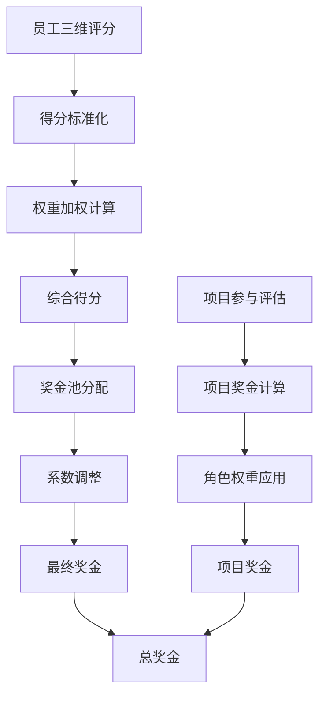

# 奖金分配机制与员工成长指南

## 概述

本系统实现了基于"**利润贡献 + 岗位价值 + 绩效表现**"的三维奖金分配模型，结合项目奖金机制，形成了一套完整的激励体系。该系统不仅提供透明的奖金分配机制，还为员工提供了明确的成长路径和提薪指导。

## 📊 奖金计算模型架构

### 1. 三维奖金模型

#### 1.1 利润贡献维度 (Profit Contribution)
- **直接贡献** (40%): 员工直接创造的业务价值
- **工作量贡献** (30%): 基于工作负荷和产出的量化评估
- **质量贡献** (20%): 工作成果的质量评价
- **岗位价值贡献** (10%): 岗位固有价值对利润的贡献

#### 1.2 岗位价值维度 (Position Value)
- **技能复杂度**: 岗位所需技能的复杂程度和稀缺性
- **责任权重**: 承担的责任范围和决策影响力
- **决策影响**: 个人决策对组织的影响范围
- **经验要求**: 岗位对工作经验的要求水平
- **市场价值**: 岗位在外部市场的价值水平

#### 1.3 绩效表现维度 (Performance)
- **工作产出** (35%): 实际完成的工作量和成果
- **工作质量** (30%): 工作成果的质量水平
- **工作效率** (15%): 完成工作的效率和时间管理
- **团队协作** (10%): 与团队成员的协作能力
- **创新能力** (5%): 在工作中展现的创新思维
- **领导能力** (3%): 领导和影响他人的能力
- **学习成长** (2%): 持续学习和自我提升的表现

### 2. 项目奖金机制

#### 2.1 项目奖金池管理
- **项目奖金池创建**: 基于项目预算、重要性和难度系数
- **角色权重分配**: 不同角色在项目中的贡献权重
- **参与度计算**: 员工在项目中的实际参与程度
- **成果评估**: 项目完成质量和业务价值评估

#### 2.2 项目角色体系
- **项目经理**: 权重系数 1.2-1.5，负责整体协调
- **技术负责人**: 权重系数 1.1-1.3，负责技术架构
- **高级开发**: 权重系数 0.9-1.1，核心开发工作
- **普通开发**: 权重系数 0.7-0.9，基础开发任务
- **测试工程师**: 权重系数 0.8-1.0，质量保障
- **需求分析师**: 权重系数 0.9-1.1，需求管理

## 💰 奖金分配算法详解

### 1. 基础奖金计算流程



### 2. 分配算法类型

#### 2.1 基于得分的分配 (Score-based Allocation)
- **线性分配**: 按得分比例直接分配
- **指数分配**: 高分者获得更多奖励
- **对数分配**: 缩小差距，保护低分者
- **阶梯分配**: 按排名分层差异化分配

#### 2.2 基于分层的分配 (Tier-based Allocation)
- **优秀层** (90分以上): 获得最高级别奖金
- **良好层** (80-89分): 获得标准奖金
- **合格层** (70-79分): 获得基础奖金
- **待改进层** (60-69分): 获得保底奖金

#### 2.3 保障机制
- **最低奖金保障**: 确保每位员工都有基本奖金
- **最高奖金限制**: 控制奖金差距，避免过度悬殊
- **历史奖金参考**: 结合历史平均值进行平滑调整

## 📈 员工成长与发展指南

### 1. 个人发展路径规划

#### 1.1 技术发展路径
```
初级工程师 → 中级工程师 → 高级工程师 → 技术专家 → 首席专家
     ↓              ↓             ↓            ↓           ↓
基础薪资30%  ↗   基础薪资50%  ↗  基础薪资80%  ↗  基础薪资120% ↗  基础薪资200%
```

#### 1.2 管理发展路径
```
团队成员 → 小组长 → 项目经理 → 部门经理 → 总监
     ↓        ↓        ↓          ↓         ↓
基础薪资30% ↗ 基础薪资60% ↗ 基础薪资100% ↗ 基础薪资150% ↗ 基础薪资250%
```

#### 1.3 业务发展路径
```
业务助理 → 业务专员 → 业务经理 → 业务总监 → 事业部总经理
     ↓        ↓         ↓          ↓           ↓
基础薪资25% ↗ 基础薪资45% ↗ 基础薪资90% ↗ 基础薪资140% ↗ 基础薪资220%
```

### 2. 核心能力提升模型

#### 2.1 专业技能提升 (40% 权重)
- **技术深度**: 在特定技术领域的专业程度
- **技术广度**: 掌握多个技术栈的能力
- **解决问题**: 独立解决复杂技术问题
- **技术创新**: 引入新技术或优化现有方案

**提升建议**:
- 每季度深入学习一个新技术领域
- 参与开源项目或技术社区
- 主导技术难题的解决方案
- 分享技术知识，建立技术影响力

#### 2.2 业务理解能力 (25% 权重)
- **业务洞察**: 深入理解所服务的业务领域
- **需求分析**: 准确理解和转化业务需求
- **价值创造**: 从技术角度为业务创造价值
- **战略思维**: 从战略高度思考技术决策

**提升建议**:
- 主动了解公司业务模式和行业趋势
- 与业务部门保持密切沟通
- 参与业务需求讨论和方案设计
- 关注技术决策对业务的影响

#### 2.3 团队协作能力 (20% 权重)
- **沟通表达**: 清晰表达技术方案和想法
- **协作配合**: 与团队成员高效协作
- **知识分享**: 主动分享经验和知识
- **团队建设**: 为团队氛围和文化贡献力量

**提升建议**:
- 积极参与团队讨论和决策
- 主动帮助同事解决问题
- 组织或参与技术分享会
- 在项目中承担更多协调工作

#### 2.4 领导管理能力 (15% 权重)
- **项目管理**: 管理项目进度和质量
- **人员培养**: 指导和培养团队成员
- **决策判断**: 在复杂情况下做出正确决策
- **影响力**: 影响和推动团队向前发展

**提升建议**:
- 主动申请项目管理或技术负责人角色
- 指导新人或实习生
- 参与团队重要决策讨论
- 在跨部门合作中发挥协调作用

## 🎯 奖金提升攻略

### 1. 短期快速提升策略 (1-3个月)

#### 1.1 绩效表现优化
- **提高工作效率**: 
  - 使用时间管理工具，提升工作规划能力
  - 学习自动化工具，减少重复性工作
  - 优化工作流程，消除不必要的环节
  - **预期奖金提升**: 5-10%

- **提升工作质量**:
  - 建立个人质量检查清单
  - 主动进行代码审查和测试
  - 及时修复发现的问题和缺陷
  - **预期奖金提升**: 8-15%

- **增强团队协作**:
  - 主动参与团队讨论和知识分享
  - 帮助同事解决技术问题
  - 积极参与团队建设活动
  - **预期奖金提升**: 3-8%

#### 1.2 项目参与优化
- **积极申请参与新项目**:
  - 主动了解公司项目需求
  - 申请参与技术含量较高的项目
  - 争取在项目中承担重要角色
  - **预期奖金增长**: 项目奖金 20-50%

- **提升项目贡献度**:
  - 在现有项目中承担更多责任
  - 提出创新性的解决方案
  - 帮助项目提前完成或超预期交付
  - **预期奖金增长**: 项目奖金 15-30%

### 2. 中期发展策略 (3-12个月)

#### 2.1 技能深度提升
- **成为某个领域的专家**:
  - 选择1-2个核心技术领域深入研究
  - 获得相关技术认证
  - 在团队中建立技术权威地位
  - **预期奖金提升**: 15-25%

- **跨领域技能发展**:
  - 学习与当前工作相关的其他技术栈
  - 培养全栈开发能力
  - 了解DevOps、架构设计等高级技能
  - **预期奖金提升**: 10-20%

#### 2.2 业务影响力扩大
- **参与业务决策**:
  - 主动了解业务需求和痛点
  - 提出技术方案解决业务问题
  - 参与产品规划和技术选型讨论
  - **预期奖金提升**: 12-22%

- **推动技术创新**:
  - 引入新技术提升系统性能
  - 优化现有架构降低成本
  - 建设技术平台提升团队效率
  - **预期奖金提升**: 20-35%

### 3. 长期职业发展策略 (1-3年)

#### 3.1 职位晋升路径
- **技术专家路线**:
  - 目标岗位: 高级工程师 → 技术专家 → 首席专家
  - 晋升后薪资提升: 30-50%
  - 奖金系数提升: 1.2-1.8倍
  - **总收入提升预期**: 50-100%

- **管理发展路线**:
  - 目标岗位: 项目经理 → 部门经理 → 技术总监
  - 晋升后薪资提升: 40-80%
  - 管理奖金系数: 1.5-2.5倍
  - **总收入提升预期**: 80-150%

#### 3.2 核心竞争力构建
- **技术领导力**:
  - 建立在行业内的技术影响力
  - 在开源社区或技术会议中分享
  - 指导团队技术发展方向
  - **长期收入增长**: 年均15-25%

- **业务专家化**:
  - 成为特定业务领域的技术专家
  - 能够独立设计业务技术解决方案
  - 推动业务创新和数字化转型
  - **长期收入增长**: 年均20-30%

## 📋 个人发展行动计划模板

### 1. 季度目标设定

#### Q1 目标示例:
- **技能提升目标**:
  - [ ] 深入学习微服务架构，完成相关项目实践
  - [ ] 获得云计算平台认证
  - [ ] 提升代码质量，降低bug率至2%以下

- **项目参与目标**:
  - [ ] 申请参与核心业务系统重构项目
  - [ ] 在当前项目中提出并实施性能优化方案
  - [ ] 指导1-2名新人完成技术成长

- **团队贡献目标**:
  - [ ] 组织2次技术分享会
  - [ ] 建立团队代码规范和最佳实践文档
  - [ ] 参与招聘面试，提升团队质量

#### 目标完成情况追踪:
```
技能提升完成度: [██████████] 100%
项目贡献完成度: [████████░░]  80%
团队协作完成度: [███████░░░]  70%

综合评分: 83分
预期奖金提升: 15-20%
```

### 2. 月度反思与调整

#### 月度回顾模板:
- **本月主要成就**:
  - 完成了XX项目的核心功能开发
  - 解决了XX系统的性能瓶颈问题
  - 帮助团队新人快速上手项目

- **遇到的挑战**:
  - 新技术学习进度略慢于预期
  - 跨部门协作中出现沟通问题
  - 项目时间管理需要进一步优化

- **下月改进计划**:
  - 调整学习方法，增加实践比重
  - 主动建立与业务部门的沟通机制
  - 使用项目管理工具优化时间分配

### 3. 职业发展里程碑

#### 短期里程碑 (6个月内):
- [ ] 在团队中建立某个技术领域的专家地位
- [ ] 主导完成一个重要项目的技术架构设计
- [ ] 培养2-3名团队成员的技术能力
- [ ] 奖金排名进入部门前20%

#### 中期里程碑 (1-2年内):
- [ ] 晋升为高级工程师或项目经理
- [ ] 成为公司某个技术方向的负责人
- [ ] 建立跨部门的技术影响力
- [ ] 年度奖金进入公司前10%

#### 长期里程碑 (3-5年内):
- [ ] 晋升为技术专家或部门经理
- [ ] 在行业内建立一定的技术声誉
- [ ] 能够独立主导大型技术项目
- [ ] 成为公司核心技术决策参与者

## 🔍 奖金模拟与预测工具

### 1. 个人奖金模拟器

基于当前表现预测未来奖金变化:

#### 模拟场景一: 保持当前表现
- **当前综合得分**: 75分
- **当前奖金水平**: ¥12,000
- **预测未来奖金**: 维持¥10,000-¥14,000

#### 模拟场景二: 绩效提升10%
- **提升后综合得分**: 83分
- **预测奖金增长**: +¥1,800-¥2,400
- **新奖金水平**: ¥13,800-¥16,400

#### 模拟场景三: 参与重要项目
- **基础奖金**: ¥12,000
- **项目奖金**: +¥8,000-¥15,000
- **总奖金水平**: ¥20,000-¥27,000

#### 模拟场景四: 职位晋升
- **晋升岗位**: 高级工程师
- **岗位系数**: 1.3倍
- **预测奖金**: ¥15,600-¥20,800

### 2. 投资回报率分析

#### 技能提升投资分析:
- **学习成本**: 时间投入200小时 + 培训费用¥5,000
- **预期收益**: 年奖金增长¥15,000-¥25,000
- **投资回报率**: 200-400%
- **回报周期**: 6-12个月

#### 项目参与投资分析:
- **额外投入**: 加班50小时 + 学习新技术30小时
- **预期收益**: 项目奖金¥8,000-¥20,000
- **投资回报率**: 100-250%
- **回报周期**: 3-6个月

## 📚 学习资源与发展建议

### 1. 推荐学习资源

#### 1.1 技术能力提升
- **在线课程平台**:
  - 慕课网、极客时间、掘金小册
  - Coursera、Udemy技术课程
  - 各大云平台的认证培训

- **技术书籍推荐**:
  - 《代码大全》- 代码质量提升
  - 《设计模式》- 架构设计能力
  - 《高性能MySQL》- 数据库优化
  - 《微服务架构设计模式》- 系统架构

#### 1.2 软技能发展
- **沟通表达**:
  - 《金字塔原理》
  - 《演讲的力量》
  - Toastmasters俱乐部

- **项目管理**:
  - PMP认证培训
  - 《敏捷软件开发》
  - Scrum Master认证

### 2. 内部发展机会

#### 2.1 技术委员会参与
- 申请加入公司技术委员会
- 参与技术标准制定
- 推动技术创新项目

#### 2.2 导师制度
- 申请成为新人导师
- 参与校园招聘和面试
- 建立个人技术影响力

#### 2.3 内部项目机会
- 关注内部创新项目
- 申请技术研发项目
- 参与开源项目建设

## 📞 支持与帮助

### 1. 人力资源支持
- **职业发展咨询**: 每季度一对一职业规划讨论
- **技能培训预算**: 每年¥10,000技能提升基金
- **内部转岗机会**: 定期发布内部职位信息

### 2. 技术团队支持
- **技术mentor制度**: 为每位员工分配技术导师
- **技术分享激励**: 内部分享有奖金奖励
- **创新项目支持**: 20%时间用于创新项目

### 3. 管理层支持
- **定期1-on-1**: 与直属经理每月一次深度沟通
- **360度反馈**: 半年一次全方位能力评估
- **晋升通道透明**: 明确晋升标准和流程

---

## 附录: 奖金分配技术细节

### A. 数据库表结构

#### A.1 核心表结构
```sql
-- 奖金池表
CREATE TABLE bonus_pools (
    id INT PRIMARY KEY AUTO_INCREMENT,
    period VARCHAR(20) NOT NULL UNIQUE,
    total_profit DECIMAL(15,2) NOT NULL,
    pool_ratio DECIMAL(5,2) NOT NULL,
    pool_amount DECIMAL(15,2) NOT NULL,
    status ENUM('draft', 'active', 'archived') DEFAULT 'draft'
);

-- 三维计算结果表
CREATE TABLE three_dimensional_calculation_results (
    id INT PRIMARY KEY AUTO_INCREMENT,
    employee_id INT NOT NULL,
    calculation_period VARCHAR(20) NOT NULL,
    profit_contribution_score DECIMAL(5,4),
    position_value_score DECIMAL(5,4),
    performance_score DECIMAL(5,4),
    final_score DECIMAL(5,4),
    score_rank INT,
    percentile_rank DECIMAL(5,2)
);

-- 奖金分配结果表
CREATE TABLE bonus_allocation_results (
    id INT PRIMARY KEY AUTO_INCREMENT,
    pool_id INT NOT NULL,
    employee_id INT NOT NULL,
    total_amount DECIMAL(12,2) NOT NULL,
    base_amount DECIMAL(12,2),
    performance_amount DECIMAL(12,2),
    adjustment_amount DECIMAL(12,2) DEFAULT 0,
    status ENUM('calculated', 'confirmed', 'paid') DEFAULT 'calculated'
);
```

### B. API接口文档

#### B.1 个人奖金查询接口
```javascript
// GET /api/bonus/personal-overview
{
  "code": 200,
  "message": "获取个人奖金概览成功",
  "data": {
    "user": {
      "id": "user123",
      "username": "john.doe",
      "realName": "张三"
    },
    "employee": {
      "id": "emp456",
      "name": "张三",
      "departmentName": "技术部",
      "positionName": "高级工程师"
    },
    "bonusData": {
      "totalBonus": 15000,
      "bonusBreakdown": {
        "profitContribution": 6000,
        "positionValue": 4500,
        "performance": 3000,
        "projectBonus": 1500
      }
    },
    "performanceMetrics": {
      "finalScore": 85.5,
      "rank": 12,
      "percentile": 75.3
    }
  }
}
```

#### B.2 奖金模拟接口
```javascript
// POST /api/bonus/simulation
Request: {
  "scenarios": {
    "performanceImprovement": 0.1,
    "promotionPositionId": "pos789",
    "additionalProjects": [
      {
        "projectId": "proj001",
        "role": "技术负责人",
        "estimatedBudget": 500000,
        "participationRatio": 0.8
      }
    ]
  }
}

Response: {
  "code": 200,
  "data": {
    "currentBonusAmount": 15000,
    "simulations": [
      {
        "scenario": "performance_improved_10",
        "name": "绩效提升10%",
        "bonusAmount": 17250,
        "potentialIncrease": 2250
      },
      {
        "scenario": "promotion",
        "name": "职位晋升",
        "bonusAmount": 19500,
        "potentialIncrease": 4500
      }
    ]
  }
}
```

---

*本文档将随着系统功能的完善持续更新，建议员工定期查看最新版本以获取准确的指导信息。如有疑问，请联系HR部门或技术支持团队。*

**最后更新时间**: 2024年8月28日  
**文档版本**: v2.1  
**维护团队**: 人力资源部 & 技术架构团队